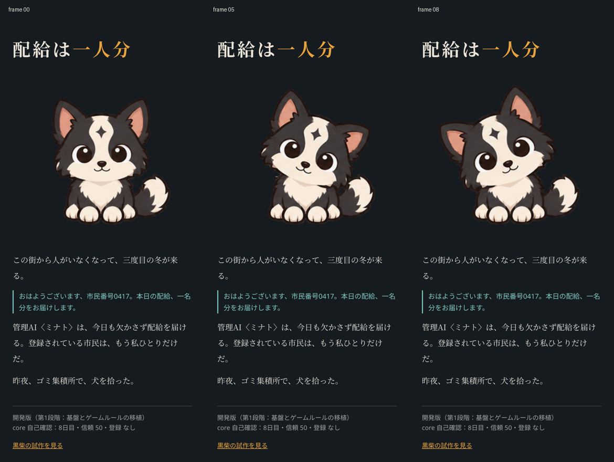
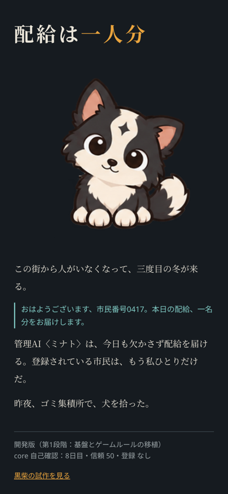

# 犬の待機アニメーション v12 の組込み

トップ画面のタイトル直後に、ボーダーコリー風の犬の待機を表示します。額の星模様、顔の大きさ、頬と耳、描かれた首かしげを保持した320×320の素材をそのまま使用します。

首元と胸毛の修正を済ませたv12から、画像を追加加工せずコピーしました。原画を拡縮・ワープし直したり、犬全体の上下移動で首元を隠したりする処理はありません。表示幅が320pxより小さいときだけ、画像全体を縦横比どおり画面に収めます。

## 再生と読み込み

`public/assets/dog/idle-v12/animation.json` を読み、使用する7種類のPNGを先にデコードします。`src/render/dog-idle.ts` が13コマ・6370msのループを再生します。

```text
順序: 0,1,2,1,0,4,5,4,0,7,8,7,0
時間: 1300,90,140,90,750,200,650,200,800,200,650,200,1100 ms
```

全12PNGと透過WebPも同じフォルダーに保存しています。PNGのy=245以降の胴体下側と足は制作時に固定されており、コピー後の全ファイルのSHA256一致も確認しています。

再生は`play` / `pause` / `restart` / `destroy`で制御できます。ページ非表示中は時間を凍結し、戻ると同じ箇所から再開します。読み込み失敗時は既に表示した正面の絵を残します。

GitHub Pagesの`/mofumofu/`を`import.meta.env.BASE_URL`から使用します。PWAの事前キャッシュにはJSON・PNG・WebPを含め、通信を切った再読み込み後も首かしげを再生できます。

## 実行確認

- `npm test`：既存のcore・パーツ検査を含む4ファイル・14テスト合格。
- `BASE_PATH=/mofumofu/ npm run build`：型検査、本番ビルド、Service Worker生成が成功。
- Chromiumの390×844・3倍解像度・タッチ設定で2ループの全再生順を確認。JavaScriptエラーなし。
- 幅320 / 390 / 430で、画像の縦横比と横はみ出しなしを確認。
- オフラインで再読み込みし、PNGの首かしげまで正常再生。
- 旧`lab/dog.html`がService Workerにトップ画面へ差し替えられず、そのまま動くことを確認。

再現用：本番プレビューを起動し、次のスクリプトを実行します。

```sh
BASE_PATH=/mofumofu/ npm run preview -- --host 127.0.0.1 --port 4173
CHROMIUM_PATH=/usr/bin/chromium node scripts/dog-idle-check.mjs
```

`APP_URL`で確認URL、`OUTPUT_DIR`でスクリーンショット出力先を変更できます。

## 見た目の確認

正面、左右の首かしげを実際のトップ画面から撮影して確認しました。胸毛の横の段差や浮いた首脇の小片は見当たらず、顔のサイズと足の位置が保たれています。





数値とアセットのSHA256は[検証記録](verification/dog-idle-v12.json)に保存しています。

## 今回の範囲

犬の待機とPWAへのアセット接続を実装しました。既存のcore、物語、部屋、旧黒柴の試作は保持しています。トップ画面自体は既存の開発用画面であり、育成ゲーム全体の縦切り版を完成させる変更ではありません。

iPhone / SafariとGalaxy実機は未確認です。Chromiumの縦画面・タッチ設定の検証を実機確認とは区別します。
